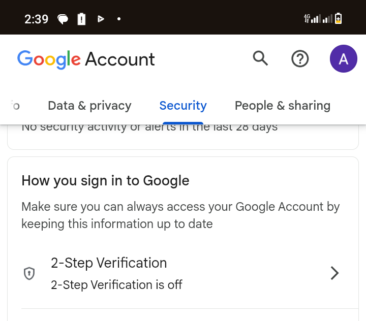
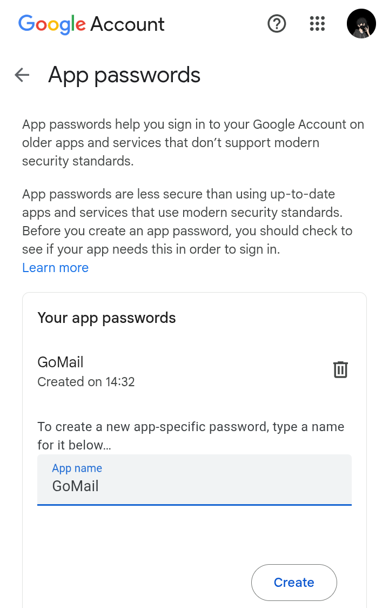

# GoMail
GoMail is a free and convienent CLI tool for sending emails quickly

# How it Works
1. Enable 2FA authentication on your Google account
2. Generate an App Password from your account
3. Use the application seamlessly

# Example
### Click [myaccount](https://myaccount.google.com) and Enable 2FA in your Google account


### Go to [google-app-password](https://myaccount.google.com/apppasswords), create an app and copy the password


# How to use
1. First save your credentials with this command
```bash
.\gomail.exe -a save -from "youremail" -password "your-generated-app-password"
```

2. ***Second Compose your message in the res/message.txt***

3. Third send your msg to your reciever
```bash
.\gomail.exe -a send -to "receipent's email"
```

4. ***To send to multiple receipients, seperate by a comma ","***
```bash
.\gomail.exe -a send -to "first@gmail.com, second@gmail.com, third@gmail.com"
```

### NB: you should compose your message in the ***message.txt*** in the ***res*** folder